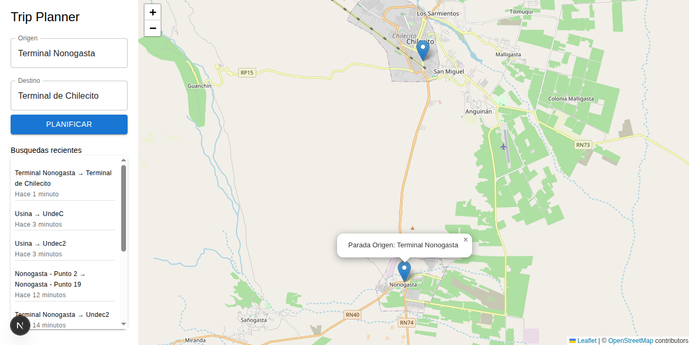
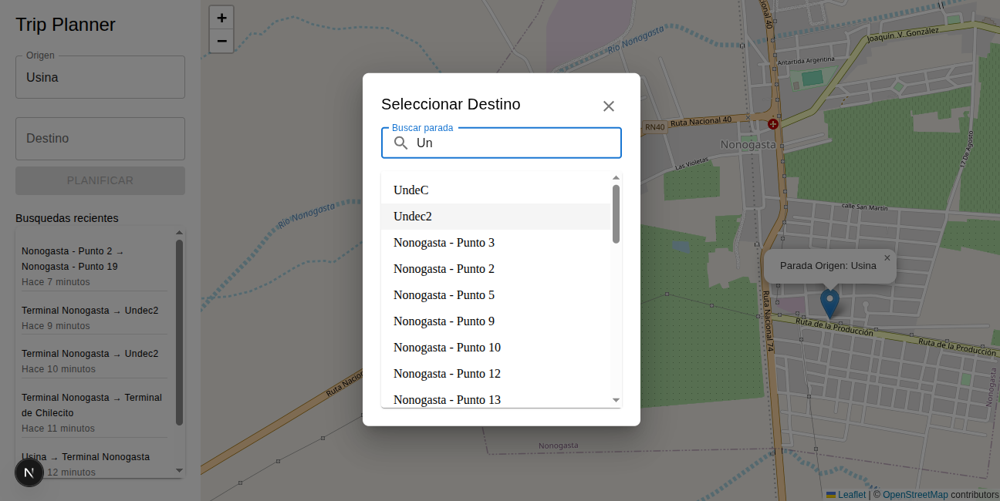
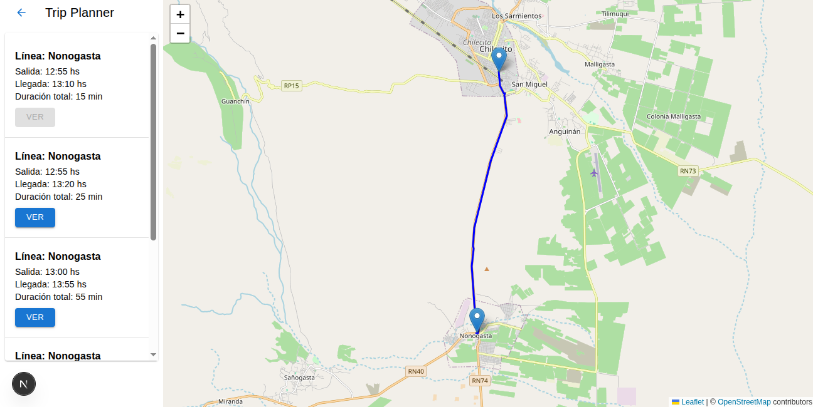
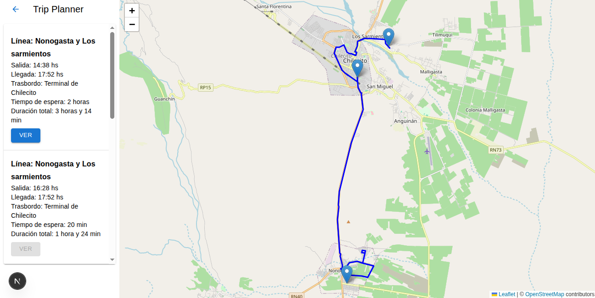

# 🚍 Trip-planner-Demo (Next.js + Leaflet.js)

A visual trip planner app that allows users to search for routes between an origin and a destination using direct or transfer connections.

## Technologies and Libraries
* Next.js – React framework for server-side rendering and static site generation
* Neo4j – Graph database for efficient route calculations
* Axios – For HTTP requests
* Zustand – Lightweight state management
* Material UI – UI components
* Leaflet.js – Interactive maps

⚙️ Environment Setup
Create a .env.local file in the root directory and configure the following environment variables:

```bash
NEO4J_URI=bolt://localhost:7687
NEO4J_USER=neo4j
NEO4J_PASSWORD=your_password
NEXT_PUBLIC_URI=http://localhost:3000
```

## 🚀 Running the Development Server

### 1. Install dependencies:
```bash
npm install
```

### 2. Start the development server:
```bash
npm run dev
```

## Screenshots

<p align="center"> <strong>🏠 Home Page</strong><br> <br><br>
<strong>🔍 Search Origin and Destination</strong><br>
<br><br>

<strong>🟢 Direct Route (No Transfer)</strong><br>
<br><br>

<strong>🟡 Route with Transfer</strong><br>
<br><br>

</p>
